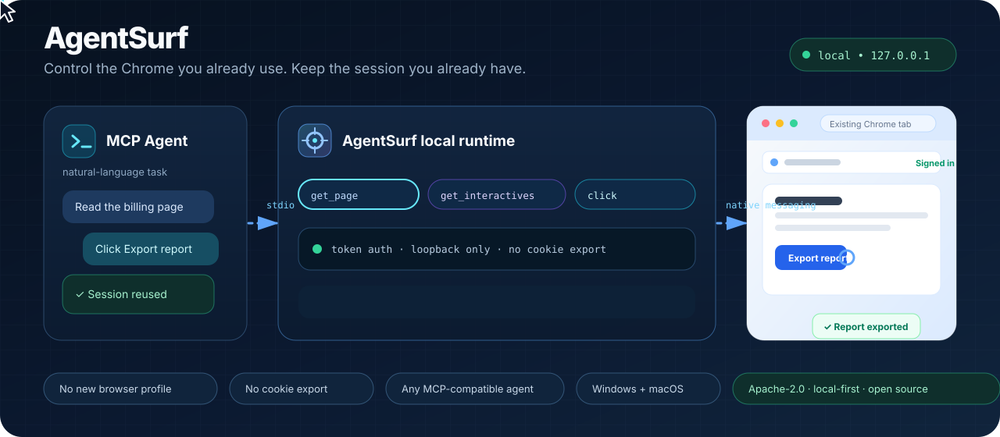

# AgentSurf

[](https://github.com/ztao0916/agentsurf-browser-control-runtime/actions/workflows/ci.yml)
[](LICENSE)
[](https://opensource.org/license/apache-2-0)

[中文](README.md) ｜ **English**

> This project is linked with and recognizes the [LINUX DO](https://linux.do/) community.

AgentSurf is a local Chrome control runtime for AI agents. You can think of it as a universal version of the ChatGPT browser extension: the same idea of letting AI drive a browser, but without being tied to ChatGPT — any MCP-capable agent can connect. It drives **the Chrome you already use**, so it keeps your existing logins, and exposes page reading, clicking, typing, screenshots, iframes, and console inspection as a uniform set of `browser.*` tools through a local MCP server. It ships no model calls and no task planning.



> Integration: MCP server. Verified on both Windows and macOS. First setup usually takes 5–10 minutes — hand this section to your AI agent and let it walk you through it.

## Quick start

Verified on both Windows and macOS. Nothing here needs administrator rights, and nothing changes the logins or settings you already have in Chrome.

### Prerequisites

| Needed | Version and check command |
| --- | --- |
| Node.js | 20+, `node -v` |
| npm | 10+, `npm -v` |
| Chrome | 116+, open `chrome://version` in the address bar |

### Install and register

For a first-time install, run:

```bash
git clone https://github.com/ztao0916/agentsurf-browser-control-runtime.git
cd agentsurf-browser-control-runtime
npm run setup
```

The wizard installs dependencies, builds the extension, and registers the native host, prompting you to:

1. open `chrome://extensions` and turn on Developer mode;
2. click **Load unpacked** and select the project's `dist/` folder;
3. copy the extension ID shown on the AgentSurf card and paste it into the terminal;
4. copy the MCP config JSON printed at the end for the next step.

> If the extension ID changes after switching machines, moving the project, or reloading the extension, run `npm run setup` again.

### Reload the extension and confirm the link

1. Back in `chrome://extensions`, click the **reload** button (🔄) on the AgentSurf card;
2. open the address below (or just click the AgentSurf icon in the toolbar — it opens the same page):

```text
chrome-extension://<extension ID>/debug.html
```

3. You should see:

```text
● connected
Host      com.browsercontrol.runtime
Endpoint  ws://127.0.0.1:8765
Pending   0
```

If it is not connected: click **Disconnect** once, wait a second, then click **Connect**. **Do not click Reconnect repeatedly** — that produces a reconnect storm.

### Connect your agent (MCP config)

Paste the JSON printed by the installer into your agent's MCP config file. Using pi's `~/.pi/agent/mcp.json` as the example (`command` is whatever path the script printed):

```jsonc
{
  "mcpServers": {
    "agentsurf": {
      "command": "absolute path to the launcher printed by the installer"
      // Example: "command": "/Users/XXX/Library/Application Support/BrowserControlRuntime/agentsurf-mcp.sh"
    }
  }
}
```

> Other MCP clients work the same way; only the **location** of the config file differs, and the JSON you paste is identical.

Four things to know:

- there are **no `args`**. Copy the printed block verbatim — **do not assemble the path yourself**;
- **restart the MCP client** (or its session) after editing the config; it is only read at startup;
- no environment variables are needed; the MCP server reads the `config.json` written during installation;
- after switching machines, moving the project, or changing your Node install, **re-run `npm run setup`** to regenerate the launcher.

## Why this exists

The reason is practical: browser control in recent Codex versions kept failing for me. Rather than wait for a fix, I wrote a more reliable path myself.

The design bet is simple: instead of having an agent open a fresh browser and move your logins into it, let it use the Chrome you already have. Logins, tabs, and extensions are all in place, so there is one less setup step — and one less class of errors.

So AgentSurf is not trying to be a feature-complete browser automation framework. The goal is to make "an agent controlling a browser" dependable: the chain can be verified, failures can be located, and the context in your Chrome is reused directly. The same idea is not limited to Codex — any MCP-capable agent can use this path.

## Usage experience

These are my hands-on notes from three clients:

- **Codex**: connected cleanly; the tools were discovered and called correctly, and everyday page operations felt smooth.
- **Command Code agent**: connected through the same MCP setup with no issues.
- **pi agent**: setup was equally smooth, and the experience was broadly the same as the other two.

All three clients connected and called the tools reliably, and the overall experience was stable and pleasant. This is just my personal impression — different agents may call the tools in different ways and get different results.

## Table of contents

- [1. What it is](#1-what-it-is)
- [2. How it works](#2-how-it-works)
- [3. MCP server integration](#3-mcp-server-integration)
- [4. Verifying the setup](#4-verifying-the-setup)
- [5. Driving it from an agent](#5-driving-it-from-an-agent)
- [6. Safety boundaries](#6-safety-boundaries)
- [7. License](#7-license)

## 1. What it is

In one sentence: **when your agent needs to operate a web page, it borrows the Chrome you are already using instead of launching a clean browser profile.**

What it gives you:

- your existing Chrome sessions and tabs — no re-login, no cookie export;
- **30 `browser.*` tools**: tabs, page reading, element clicks and typing, forms, scrolling, drag, screenshots, iframes, console, downloads, file upload;
- an **opaque `element_id`** model instead of CSS selectors, with every action re-checked for visibility, enabled state, and page revision;
- a local MCP server, so the agent side is just one stdio MCP entry.

What it does not do:

- no built-in model, no task planning;
- no cloud browser: everything talks over `127.0.0.1`;
- no CAPTCHA solving or anti-bot evasion.

## 2. How it works

```text
        MCP client (your agent)
              │  stdio
              ▼
        AgentSurf MCP Server
              │  WebSocket + token, bound to 127.0.0.1 only
              ▼
        local Browser Bridge
              │  Chrome Native Messaging (length-prefixed frames over stdin/stdout)
              ▼
        Native Host (native-host.exe / native-host.sh)
              │  chrome.runtime.connectNative
              ▼
        Chrome extension (Manifest V3)
              │  chrome.tabs.sendMessage / chrome.debugger
              ▼
        the page (Page Agent content script, injected into every frame)
```

Key consequences:

- **The extension is the initiator.** It calls `connectNative` on startup, which starts the native host, which starts the bridge. You never need to run `npm run bridge` for normal use.
- The extension **listens on no port at all**; the bridge only binds `127.0.0.1` and requires a token (generated by the installer, stored on disk, never pasted into a chat).
- The MCP server and the native host **share the same local config**, so you do not copy tokens between them.
- A standalone bridge exists only for protocol development — see [Development and debugging](docs/reference.en.md#3-development-and-debugging).

## 3. MCP server integration

Agent ↔ `dist/mcp/cli.js` (stdio MCP server) ↔ Bridge ↔ extension.

The agent carries no protocol burden: the MCP server exposes every tool and its schema, so all you do is paste one JSON block into your client's MCP config — see [Connect your agent](#connect-your-agent-mcp-config) in Quick start.

> The extension and native host in [Quick start](#quick-start) must be installed first; that is the foundation for everything else.

## 4. Verifying the setup

Verify from the inside out; this is what makes failures easy to localize.

### 4.1 Is the bridge listening?

```powershell
# Windows
Get-NetTCPConnection -LocalPort 8765 -State Listen |
  Select-Object LocalAddress, LocalPort, OwningProcess
```

```sh
# macOS
lsof -nP -iTCP:8765 -sTCP:LISTEN
```

A listener means the bridge is up (the extension successfully spawned the host).

### 4.2 Does the whole link work without the MCP client?

The repo ships a script that acts as a minimal external agent:

```powershell
node scripts/call-tool.mjs '{"protocol_version":"1","request_id":"smoke","tool":"browser.list_tabs","args":{}}'
```

> Single quotes work in both PowerShell and bash/zsh. Keep the JSON free of spaces, or PowerShell will split the argument.

Getting your real tab list back (`ok: true`) proves the whole path
**bridge → native host → extension → Chrome APIs**.

> This step carries no session, so the list only shows unclaimed tabs: anything another conversation holds is hidden and counted in `other_session_tabs`; add `include_all: true` to see everything. That is only the visible scope — the link check itself is unaffected.

This step is the dividing line for troubleshooting:

| Result | Conclusion |
| --- | --- |
| Fails here | link problem |
| Works here, fails in MCP | MCP config problem (paths, Node, client not restarted) |

### 4.3 End-to-end smoke test

In the agent, in order: `browser_list_tabs`, then `browser_get_page_content` on a normal page, then `browser_screenshot`. Screenshots go through CDP, so the tab shows a "Chrome is being debugged" banner; reloading that tab removes it.

## 5. Driving it from an agent

### 5.1 Read-only pass first

```text
1. browser_list_tabs                                  # see what exists before touching anything
2. browser_open {"url":"https://example.com","activate":true}
3. browser_get_page {"tab_id":...}                    # URL, load state, revision
4. browser_get_page_content {"tab_id":...}            # body text
```

`browser_get_page` returns **metadata, not article text**. To open a URL use `browser_open`; there is **no** `browser_navigate`.

### 5.2 Element actions (the `element_id` model)

```text
1. browser_get_interactives {"tab_id":...}            # snapshot
2. browser_click {"tab_id":..., "element_id":"el_..."}
```

Rules:

- **Only use `element_id` values returned by `browser_get_interactives`.** Never invent selectors or IDs.
- An `element_id` is bound to a document, a page revision, and a frame. When the page changes it goes stale (`stale_element`) — call `get_interactives` again and retry.
- Modifier keys:

```json
{"tab_id": 123, "element_id": "el_...", "key": "a", "modifiers": ["Control"]}
```

- Text selection inside an editable element:

```json
{"tab_id": 123, "element_id": "el_...", "text": "text to select"}
{"tab_id": 123, "element_id": "el_...", "selection_type": "cursor_after"}
```

### 5.3 iframes (important)

Many admin systems (ZenTao, legacy consoles, embedded payment pages) render the real content **inside an iframe**, with the outer document being just navigation chrome. Without a frame target you will only see that chrome.

```text
1. browser_get_frames {"tab_id": 123}
   → [{frame_id: 0, is_top: true, ...},
      {frame_id: 561, is_top: false, url: "about:blank", parent_frame_id: 0}]

2. browser_get_interactives {"tab_id": 123, "frame_id": 561}
3. browser_get_page_content  {"tab_id": 123, "frame_id": 561}
4. browser_click {"tab_id": 123, "frame_id": 561, "element_id": "el_..."}
```

Rules and behaviours:

- **An `element_id` is only valid inside the frame that produced it.** Always pass the same `frame_id` on the follow-up action.
- Omitting `frame_id` targets the top document, so the request usually fails with `stale_element`.
- A frame that navigated away is gone: you get a retryable `frame_not_found`; call `browser_get_frames` again.
- `about:blank` / `srcdoc` frames are supported (that is how app shells work), which is why the content scripts run in `all_frames` with `match_about_blank`.
- Cross-origin frames can be listed and their URL reported, but their content cannot be driven.

### 5.4 Observability

```text
browser_get_console_messages {"tab_id": 123}                 # console output, exceptions, rejections
browser_get_console_messages {"tab_id": 123, "frame_id": 561}
browser_observe {"tab_id": 123}                              # state + interactives + AX + screenshot
```

Console collection runs in the page's MAIN world so it sees the page's own output. It is installed **only on tabs a session has claimed, and re-injected after every navigation**: a page the agent never touched keeps its own `console` untouched. `available: false` means **the collector was not present — an empty list is not proof of silence**.

### 5.5 Parallel conversations (isolated by default)

Each conversation's MCP server process owns a session, so **the agent does not have to create one or pass `session_id`**:

- tabs it opens with `browser_open` are claimed automatically and put in **this conversation's Chrome tab group**; the title **defaults to the title of the first page the conversation touches** (for example "ZenTao - Task 17824", or its hostname while the tab is still loading), falling back to `AgentSurf` when that page gives nothing;
- **to make the group read as the task**, pass `session_name` on any call (for example `{"tab_id": 123, "session_name": "ZenTao 17824"}`): it sticks for the conversation, renames an existing group on the spot, and stops page titles from overriding it;
- another conversation is refused those tabs (`tab_in_use`), so conversations stop stepping on each other;
- use `browser_claim_tab` to take over a tab the user already had open: it claims and, by default, groups it (pass `group: false` to claim without moving it);
- `browser_list_tabs` returns this conversation's tabs plus unclaimed ones and reports the rest in `other_session_tabs`; pass `include_all: true` to see every tab (for scripts and troubleshooting);
- **leases apply to every caller**: a session-less call (a script, the CLI) is refused with `tab_in_use` on a tab another conversation holds instead of silently bypassing the check — a script that wants such a tab calls `browser.start_session` (still in the protocol, just not advertised to agents) and claims it;
- `browser_reset_sessions` ungroups, releases this conversation's leases, and **closes the tabs this conversation opened itself** — never a tab the user already had open.

Caveats:

- automatic isolation assumes **one conversation = one MCP server process** (PiDeck starts a separate process per conversation, which satisfies this). If a client multiplexes several conversations through one process, they share a session and you must pass an explicit `session_id` to separate them;
- `browser_open` on an existing `tab_id` claims that tab but deliberately leaves the tab bar alone;
- leases live in the extension's `storage.session` (**restarting Chrome clears them**), while session records persist in `storage.local`;
- **idle reclaim**: if a conversation is closed without a clean finish, the tabs it claimed are freed **and ungrouped** after **30 minutes of inactivity**, and another conversation can take them over, while a session that keeps using its tab keeps refreshing the lease;
- **finish the job**: call `browser_reset_sessions` when the work is done — it ungroups, releases the leases, and **closes the tabs this conversation opened itself** immediately (a tab the user already had open is only ungrouped, not closed); otherwise the group stays until the idle timeout. Pass `close_opened_tabs: false` to keep the tabs, and read `closed_tab_ids` to see which ones went;
- **process-exit backstop**: ending a conversation kills the MCP server process (or closes its stdin), so the process makes one best-effort `reset_sessions` before it exits. A SIGKILL cannot be caught, and that case still falls to the idle reclaim below;
- **after a reload or restart**: reloading the extension or restarting Chrome clears the leases (a Chrome behaviour), so on startup the runtime also ungroups any group whose owner no longer holds a lease, leaving no orphaned groups behind; tabs with a live lease are left alone;
- **manual escape hatch**: `browser_reset_sessions` releases this conversation's own session and any lease whose owner is gone — which is what recovers tabs stuck on a vanished conversation. Other conversations are untouched, and `other_sessions_kept` reports how many were left alone; pass `force: true` only when you really mean to release every session and ungroup their tabs, and note that **`force` only ungroups — it never closes tabs**, because that would destroy work another conversation is still doing.

## 6. Safety boundaries

AgentSurf acts on your logged-in pages, and file upload is powerful. Encode these rules in your agent's instructions:

- **read-only by default**; ask the user before submitting, saving, deleting, publishing, uploading, or sending anything;
- the user logs in themselves: never request passwords or codes, never read or print cookies, tokens, or local storage;
- never commit `config.json` or the token, and never paste them into a chat;
- never expose the bridge beyond localhost;
- screenshots go through CDP, which shows a "Chrome is being debugged" banner and conflicts with the user's own DevTools; reload that tab afterwards to clear it.

These are **instructions for the agent**, not an enforced approval layer. The caller still owns the authorization boundary.

## 7. License

AgentSurf is licensed under the [Apache License 2.0](LICENSE), including the patent grant in Section 3.
