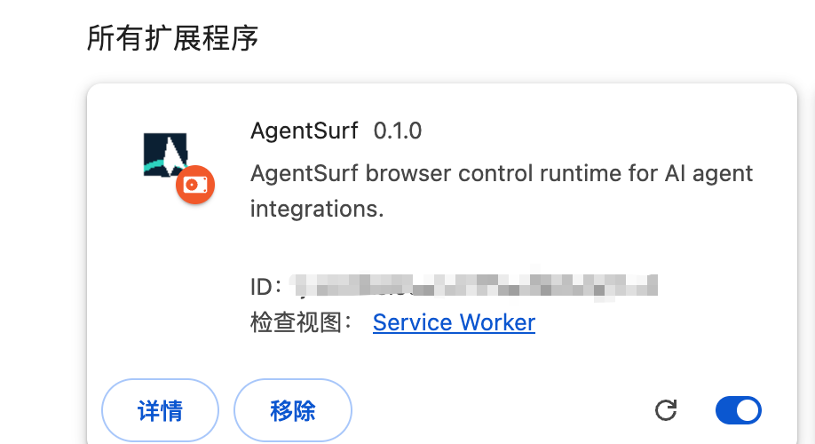
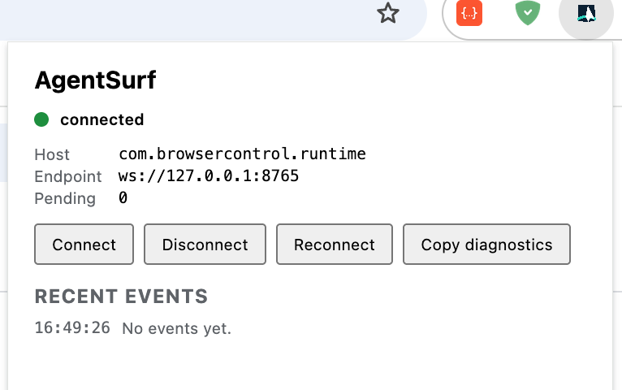

# AgentSurf

[](https://github.com/ztao0916/agentsurf-browser-control-runtime/actions/workflows/ci.yml)
[](LICENSE)
[](https://opensource.org/license/apache-2-0)

[中文](README.md) ｜ **English**

> This project is published in the [LINUX DO](https://linux.do/) community.

AgentSurf lets your AI agent operate the local Chrome or Edge browser you are already using. Think of it as a universal version of the ChatGPT browser plugin: it is not tied to one model or client, and any MCP-capable agent can use it.

It reuses your existing sessions and tabs and supports common browser actions such as reading pages, clicking, typing, scrolling, taking screenshots, uploading files, and working with iframes. You do not need to switch browsers or sign in again. Chrome and Edge can be installed together with separate ports and configuration.


> Tested with Codex, Command Code agent, and pi agent; all connected and worked correctly. Windows and macOS have both been tested on real machines, and first-time setup usually takes 5–10 minutes.

## Tested use cases

- **Pinterest**: Upload an image and fill in Pin details in your signed-in account, then stop for confirmation before publishing.
- **ZenTao**: Read tasks you have access to and summarize pending work, owners, and priorities; ask before making changes.
- **Google Trends**: Switch between terms, regions, and date ranges, then summarize notable changes from the page.

## Quick start

Give this README to an agent that can operate your computer and let it guide you through setup, or follow the steps below manually.

### 1. Prerequisites

| Requirement | Version and check |
| --- | --- |
| Node.js | 20+, run `node -v` |
| Git | run `git --version` |
| Chrome or Edge | 116+, open `chrome://version` in Chrome or `edge://version` in Edge |

> Administrator access is not required, and your existing Chrome sessions and settings will not be changed.

### 2. Install

1. Clone the repository and enter the project directory:

```bash
git clone https://github.com/ztao0916/agentsurf-browser-control-runtime.git
cd agentsurf-browser-control-runtime
```

2. Run the setup wizard:

```bash
npm run setup
```

The default keeps the original behavior: Chrome only, using the `agentsurf` MCP entry, the root `config.json`, and the existing launcher. To use Chrome and Edge together:

```bash
npm run setup -- --browser all
```

The existing `agentsurf` configuration can stay in place and continues to target Chrome. The new `agentsurf-chrome` and `agentsurf-edge` entries make the browser target explicit.

| MCP name | Target | Use |
| --- | --- | --- |
| `agentsurf` | Chrome | Default install and legacy configuration |
| `agentsurf-chrome` | Chrome | Explicit Chrome target in multi-browser mode |
| `agentsurf-edge` | Edge | Explicit Edge target in multi-browser mode |

The setup wizard installs dependencies, builds the project, registers the native host, and prompts you for each selected browser:

1. Open `chrome://extensions` in Chrome or `edge://extensions` in Edge and enable Developer mode;
2. Click “Load unpacked” and select the project's `dist/` directory;
3. Copy the AgentSurf extension ID shown in each browser and paste it back into the terminal;
4. Save the MCP config JSON printed by the setup wizard.



> The **ID** shown in the extension card is the AgentSurf extension ID requested by the setup wizard.

### 3. Check the extension connection

1. Return to each browser's extensions page and click **Reload** on the AgentSurf card;
2. Click the AgentSurf icon in the browser toolbar;
3. Seeing `● connected` means the extension is connected.



If it is not connected: click **Disconnect** once, wait one second, then click **Connect**.

### 4. Connect your agent (MCP config)

The installer prints an MCP config block whose key value is the absolute launcher path. Choose either option:

**Option A: Add it through [CC Switch](https://github.com/farion1231/cc-switch)**

1. Open CC Switch and click **MCP** in the top navigation;
2. Click **+** and choose **Custom**;
3. Set the server ID to `agentsurf-chrome` or `agentsurf-edge`, choose `stdio`, and enter the matching `command` path printed by the installer;
4. Save it, then enable sync for the target agent (for example, Claude, Codex, or Gemini);
5. Restart that agent.

> If your agent is not one of CC Switch's synced apps, use Option B.

**Option B: Ask your AI agent to configure it**

Give the complete installer output to the agent you are using, then say:

```text
Add this MCP configuration to the agent I am currently using, use the keys from the configuration, and tell me how to restart and verify it.
```

Restart the agent afterwards.

`npm run setup` prints a separate MCP configuration for each selected browser. Add the complete output to your agent. With Chrome and Edge, the structure is:

```json
{
  "mcpServers": {
    "agentsurf-chrome": {
      "command": "<absolute Chrome launcher path>"
    },
    "agentsurf-edge": {
      "command": "<absolute Edge launcher path>"
    }
  }
}
```

## Using multiple browsers

The MCP server name selects the browser. Browser names are not part of the `browser.*` tool arguments.

- The legacy `agentsurf` and explicit `agentsurf-chrome` servers both control Chrome;
- `agentsurf-edge` controls Edge;
- Each browser has its own tabs, page revisions, and sessions. Do not pass a Chrome `tab_id` or `element_id` to Edge;
- `browser.reset_sessions` only cleans up the browser selected by that MCP server.

With an agent that can choose an MCP server, state the target directly:

```text
Use agentsurf to open https://example.com and tell me the page title in Chrome.
```

```text
Use agentsurf-edge to open https://example.com and tell me the page title in Edge.
```

If the client prefixes tool names with the server name, choose `browser_list_tabs`, `browser_open`, and other tools under `agentsurf` / `agentsurf-chrome` or `agentsurf-edge`. Keep a sequence of tab operations on the same server; each server only sees the tabs in its own browser.

## Use and verify

In the conversation, tell your agent:

```text
Open https://example.com and tell me the page title.
```

If it can open the page and return the title, AgentSurf is working. You can then ask it to read, click, type, take screenshots, or perform other browser actions.

> Seeing “Chrome is being debugged” or “AgentSurf started debugging this browser” is expected during screenshots.

> For your first run, use an ordinary page. Start in read-only mode, review and approve actions such as submitting, saving, deleting, publishing, uploading, or sending, and never send passwords, verification codes, cookies, or tokens to an agent.

AgentSurf is licensed under the [Apache License 2.0](LICENSE).
